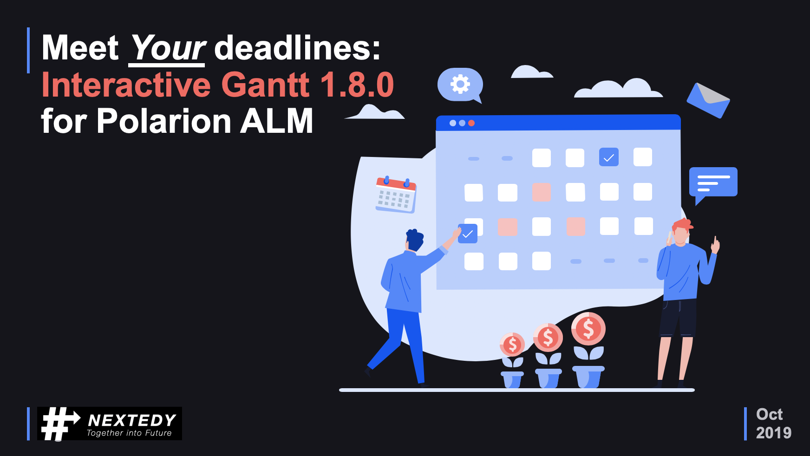

# Nextedy Gantt Widget 1.8.0

We have released a new version of the first **interactive** high-level project **planning & scheduling** inside Polarion ALM.

The new version (compared to 1.7.0) includes couple of great enhancements that we have collected from existing customers and evaluators:

 * New data mappings make it easy to map your Polarion data to the Gantt-like planning & scheduling views.
 * Support for global working calendar ensures that the planning now respects the working time settings.
 * ... and we fixed few issues that customers has reported through our [Support Portal](https://nextedy.freshdesk.com).

The list of all the improvements is available online as a [change log](../changelog).

You can download the new version from [downloads page](../download).

*Karel / On behalf of Nextedy Systems Dev Team*

 
 
 

