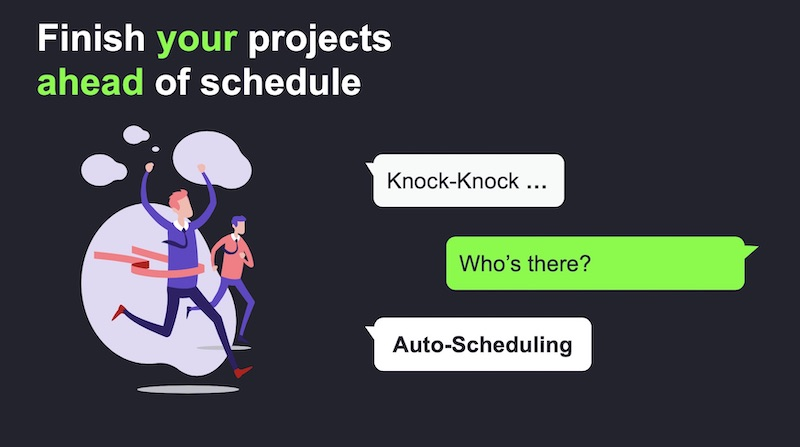

#  Nextedy Gantt Widgets 2.0 -   auto-scheduling, critical path, undo-redo, zoom in & out ...

We have released a new version of Nextedy Gantt Widgets - the first **interactive** high-level project **planning & scheduling** inside Polarion ALM.

It is a  **major**  step forward that shows where we are heading with Nextedy Gantt Widgets - we aim to make planning in Polarion both **robust** and **fun**.

## Auto-scheduling
Version 2.0 introduces the dependency auto-scheduling feature. Now items can be re-scheduled automatically based on dependency links between them.

For example, imagine that you have two items connected by a dependency link and the second item starts when the first one ends, and you want to change the schedule of the first item by moving it to a new date.

Auto scheduling updates the start date of the second item according to the end date of the first item each time when it changes (using Gantt view). This feature allows you to  **maintain the project schedule by specifying relations between items** with no need to set dates of each task manually.

This also means that auto-scheduling is triggered only when you change an item or modify a link.

As a related feature - we have added a **highlight if the start date of the dependent item is planned before the controlling item** is being finished.

You can configure if auto-scheduling should be turned on by default using a [project level settings](../context-properties) (see `nextedy.gantt.default.auto_scheduling`)

## Critical Path

To let you manage risks we added a critical project path visualization to your Gantt charts.

A critical path is a sequence of items that may not be delayed. Otherwise, the whole project would be delayed.
The critical path also determines the shortest time the project can take.

An item is considered critical if it has no days of slack and any delay would directly affect the project completion date.
Slack time is the time that an item can slip without affecting other items or the project's completion date.

You can turn it on / off as needed directly from the toolbar.  To configure if critical-path should be enabled by default use a [project level settings](../context-properties) (see `nextedy.gantt.default.critical_path`)

## Undo/Redo
The title says it all! 

## Zoom In, Zoom Out
It has been always possible to set the scale of the Gantt view. Now you can interactively zoom in and out for handy managing of time scale presentation. 

The possible scale options (set as widget property) have been extended as well to: **DD** - zoomed-in day scale, **D** - day scale, **W** - week scale, **M** - month scale, **Q** - quarter scale, **Y** -  year scale and **YY** - zoom-out year scale.

You can configure the width of time-line columns using  a [project level settings](../context-properties) (see `nextedy.gantt.zoom...`)

## Fullscreen Mode

The Nextedy Gantt Widgets 2.0 brings you also a simple but useful feature – the ability to enlarge the browser view to the full screen. It will be a very handy feature for those who work on big projects.

## Configuration Properties
As you can see above, we have added tons of configuration options that you can define on Polarion project or Global level. Check
[this link](../context-properties) to get the full list of configuration options.

##Available - Now!
You can download the new version from [downloads page](../download). 

Same price - free update for existing customers. 

*Karel / On behalf of Nextedy Systems Dev Team*

 
 
 

