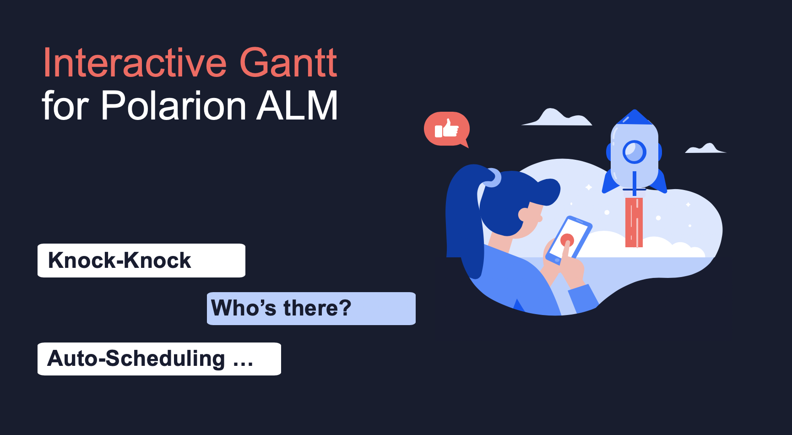
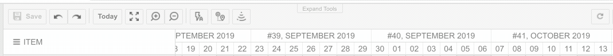
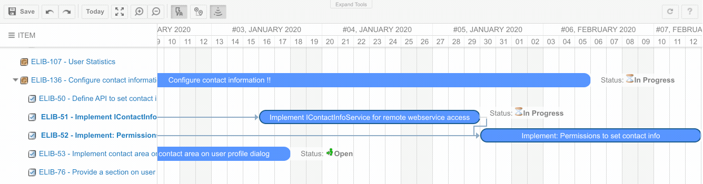
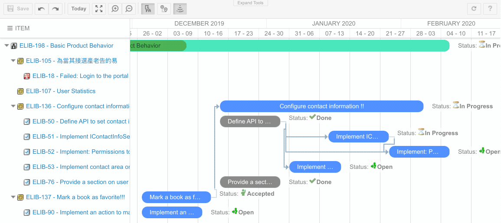
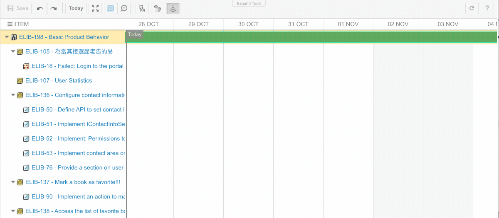

# Nextedy Gantt Widgets 2.0

We have released a **major** new version of the first **interactive** high-level project **planning & scheduling** inside Polarion ALM.

This release is **BIG**. So big that we have added a toolbar ;) 

## Auto Scheduling
Let's start with auto-scheduling - we start simple, just but making sure the dependant items gets planned after the dependencies, or simply that they get rescheduled if source item is resheduled as well. 

The auto scheduling is currently triggered only when you change an item or modify a link. 

As a related feature - we have added a highlight if the item starts before the dependency is being finished.

You can configure if auto-scheduling should be turned on by default using a [project level settings](../context-properties) (look for `nextedy.gantt.default.auto_scheduling`)

## Critical Path
To let you manage the risks we added a critical path visualization of your gantt project. You can turn it on / off to make sure you can focus on it when needed. 

You can configure if critical-path should be turned on by default using a [project level settings](../context-properties) (look for `nextedy.gantt.default.critical_path`)

## Undo/Redo
The title says it all! 

## Zoom In, Zoom Out & Full-screen
It was always able to set the scale of the Gantt view, not you can interactively zoom in and out, or even enter the full-screen mode. 

The default set of scale options has been extended: **DD** - the zoomed in day scale, **D** - the day scale, **W** - the week scale, **M** - the month scale, **Q** - the quarter scale, **Y** - the year scale and **YY** - the zoom out year scale

You can configure at least the width of time-line columns using  a [project level settings](../context-properties) (look for `nextedy.gantt.zoom...`)

## Configuration Properties
As you can see above, we have added tons of configuration options that you can define on Polarion project or Global level. Checkout
[this link](../context-properties) to get the full list of the config options.

##Available - Now!
You can download the new version from [downloads page](../download). 

Same price - free update for existing customers. 

*Karel / On behalf of Nextedy Systems Dev Team*

 
 
 

