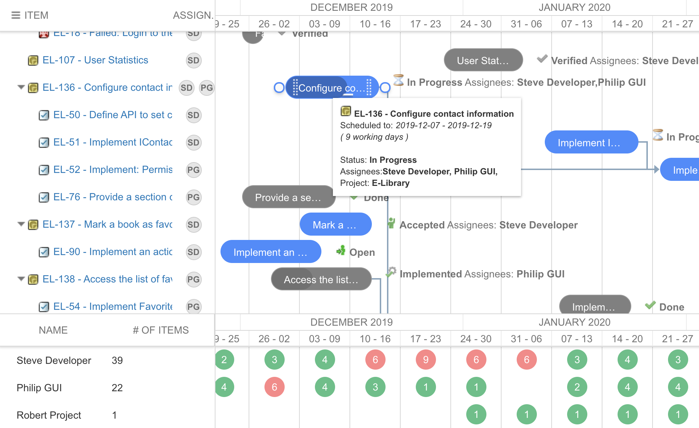

#  Nextedy Gantt Widgets 2.1 -   Resource View Panel

The new version of Nextedy Gantt Widgets brings Resource allocation view panel.

The possibility of resource management is quite critical for many projects because it helps to estimate not only a total load of a project, but its parts and load of each resource separately.

As the gantt chart resource view clearly demonstrate the total load of people and projects, it’ll be simple  to balance the resources load and manage the projects more efficiently. 

## Setup

To turn Resource Panel on set `Widget Properties > Resource View > Show Resource View` to `true`. The default is false, but you can overwrite it with context property: `nextedy.gantt.workitems.default.resource_view`.

The parameter `Items per Resource - OK limit` holds how many items per time slot are considered OK (rendered as green).  The default is `1`, but you can overwrite it with context property: `nextedy.gantt.workitems.default.resource_per_day_OK`.

The parameter `View Height` specifies the height of the pannel in pixels. The default is `250`, but you can overwrite it with context property: `nextedy.gantt.workitems.default.resource_view.height`.
  

##Available - Now!
You can download the new version from [downloads page](../download). 

*Karel / On behalf of Nextedy Systems Dev Team*

 
 
 

