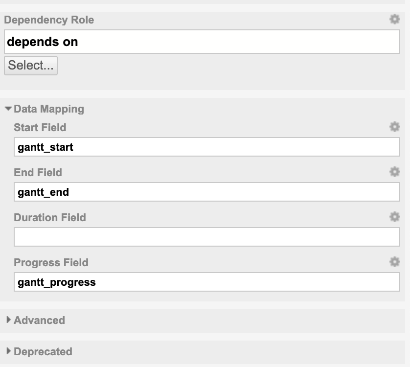
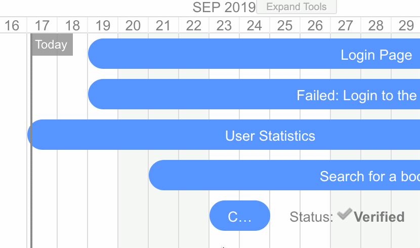
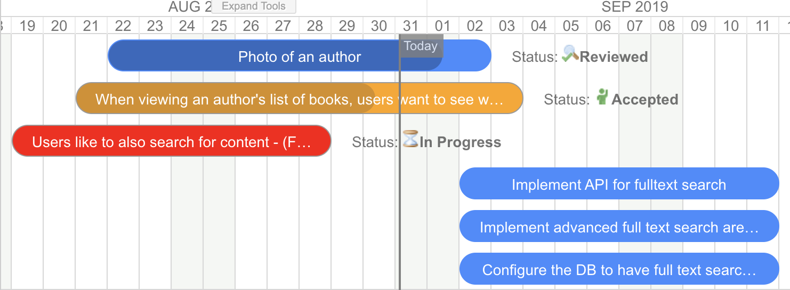
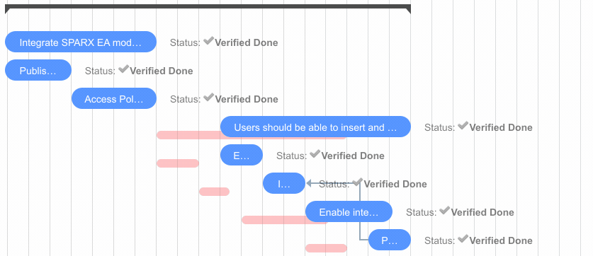
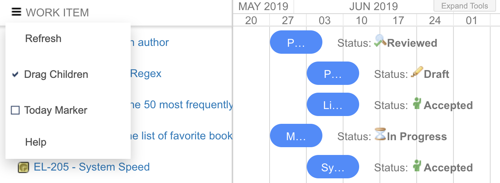

# Release Notes 
## Changelog

### 2.1.* <small>- Dec 13, 2019 </small>

**2.1.3 <small>- Dec 13, 2019 </small>**

* FIX: Weekly scale view shifted by a week

**2.1.2 <small>- Dec 9, 2019 </small>**

* Tooltips on Resource Allocation Panel
* Open Tasks from Resource Allocation Panel
* FIX: Support Gantt widget on Person Home Page / Personal Dashboard

**2.1.0 <small>- Nov 25, 2019 </small>**

* Resource Allocation Panel

Read more at [Release 2.1 Announcement](../ReleaseAnnouncement-2.1)

### 2.0.* <small>- Nov 25, 2019 </small>

**2.0.4 <small>- Nov 25, 2019 </small>**

* Fix exception when adding Gantt on Plan or TestRun pages

**2.0.3 <small>- Nov 11, 2019 </small>**

* Fix legacy Icon Url's format (for really old WF configuration)
* Remove dependency links that point to items outside of Gantt

**2.0.0 <small>- Oct 31, 2019 </small>**

* Dependency **auto-scheduling**
* **Critical-path** visualization
* Undo / Redo
* **Zoom** In / Out
* Configuration properties

Read more at [Release 2.0 Announcement](../ReleaseAnnouncement-2.0)

### 1.8.* <small>- Oct 22, 2019 </small>

**1.8.3 <small>- Oct 22, 2019 </small>**

* BUG FIX: No plans shown when PlansGantt is configured with "Show Unplanned" = NO

**1.8.2 <small>- Oct 15, 2019 </small>**

* Support UTF-8 properly (Chinese, Japanese, etc...)

**1.8.1 <small>- Oct 14, 2019 </small>**

* Fix issue with "Plans Gantt" (not loading mapping with 1.8.0 - sorry for the issue, we have extended the automated tests for PlansGantt as well so such issue will never occure again )
* Add trackerService to Items Script, this enables you to perform various calculations and store then in task.getFields().put(key,value) and render them on the gantt.

**1.8 <small>- Oct 8, 2019 </small>**

* Add support for scheduling by setting start & end date (for those who prefer explicit planning and not via Duration field). Now you can configure the widget to use any combination of data Mapping: **Start Field & Duration Field** , **End Field & Duration Field**, or **Start Field & End Field**.  The property "Start Field is End Date" is now marked as deprecated, this means it still works well, we just recommend to switch to new format and just set the End Field mapping in Data Mapping section.
* We have moved all the data mapping settings into special category "Data Mapping".

[Release 1.8.0 Announcement](../ReleaseAnnouncement-1.8.0)

 
{: style="width:450px"}
 
### 1.7.* <small>- Sep 30, 2019 </small>

** 1.7.2 <small>- Sep 30, 2019 </small>**

* Fix issue when removing dependency links.
* We support "start_to_finish" link types only so far, so create them by default.
* Inform user that just single gantt per page is supported.

** 1.7.1 <small>- Sep 17, 2019 </small>**

* Support for working days, when **Advanced > Working Calendar == YES** the item duration takes into account working days. The working calendar is defined by Global Polarion Administration > Work Items > Working Calendar

{: style="width:450px"}

**1.7 <small>- Sep 9, 2019 </small>**

* New property **Advanced > Show Today Marker** - if true, a today marker is added to the gantt.
* New property **Advanced > Start Field is End Date (calculate from end)** - this one is tricky, if it is true, than the **Start Field** will be actually treated as end date. What? Simply read more at [How to configure the gantt to compute the start date from end/due date?]()
* `widgetContext` object ([Class Javadoc](https://almdemo.polarion.com/polarion/sdk/doc/javadoc-rendering/com/polarion/alm/shared/api/model/rp/widget/RichPageWidgetRenderingContext.html)) has been added to **Markers Script**. It can be used to e.g. access the project context via `widgetContext.getDisplayedScope().projectId()`
* **Progress coloring added** - the gantt will now mark the tasks that end in the past and are unresolved as red, and those with planned progress date in a past as orange. If you do not like this behaviour, you can turn it off by adding `gantt.config.show_progress_colors=false;` into `Advanced > Gantt Config Script`. We do not want to add a widget property to control this behaviour to restrict number of properties.

### 1.6.* <small>- August 28, 2019 </small>

** 1.6.2 <small>- August 28, 2019 </small>**

* Fix for ugly bug that custom field of type Date-Time was not supported for Start/End dates. We still recomend to use Date-only but some customers prefere Date-Time.

** 1.6.1 <small>- August 27, 2019 </small>**

* Support for velocity scripting in *Advanced > Gantt Script* parameter, see use case here: [How to set the Gantt time range?](https://nextedy.freshdesk.com/support/solutions/articles/48000063422-how-to-set-the-gantt-time-range-)

** 1.6.0 <small>- August 23, 2019 </small>**

* Support for Markers Script, see [How to add Markers via Marker Script?](https://nextedy.freshdesk.com/solution/articles/48000862790-how-to-add-markers-via-marker-script)
* Regular bug-fixing
* Update of documementation (split of widget documentation pages for Work Items and Plans Gantt)

### 1.5.0 <small>- July 1, 2019</small>

* Big release with many customer enhancements and with addition of *Plans Gantt Widget* (added for free) justifies the big shift on version number.
* Support for duration fields in DurationTime format (converts to days only)
* Compare actual vs planned (requires Task Script to configure how to load the original schedule)

!!! warning
    Due to major refactoring (as we were adding support for Plans data type), the widget needs to be reconfigured when you update from 1.0 to 1.5. This shall not happen in the future versions. This was agreed upfront with paying customers.
    

### 1.0.* <small>- May 29, 2019</small>

** 1.0.3 <small>- May 29, 2019</small>**

* Action menu added
* Refresh action to reload the Gantt
* Drag children control - add an option to turn on/off drag children instantly on Gantt, the widget property  holds the default
* Today Marker - add marker for today + scroll to today
* Set Scale - add an option to set the timeline scale instantly on Gantt, the widget property would hold the default.

** 1.0.2 <small>- May 28, 2019 17:20</small>**

* Documentation improvements
* Script support added to decorate a task based on work item properties, see Widget > Task Script
* Infinite loop on parent links (should not happen in Polarion) does not cause gantt to fail (but data do not load).
* Project style support (via Task Script)
* License at polarion/polarion/gantt-lic.json

** 1.0.1 <small>- May 15, 2019</small>**

* Published on extensions.polarion.com
* New Work Items Gantt widget icon.
* Widget tags configured -  "Work Items", "Charts" 
* `gantt.config.round-dnd-dates`  reflected when dragging children
    
** 1.0.0 <small>- May 5, 2019</small> **

*  After couple of months of development and use in several customer projects we officially release the public version 1.0.0.

## Roadmap / TODO
	
Check this site: [Nextedy Systems - Feedback Portal](https://feedback.nextedy.com/)

<iframe src="https://gantt.nextedy.com/download/bnum.txt" height=35 style="padding-top:10px;border:0px solid white;"> </iframe>

