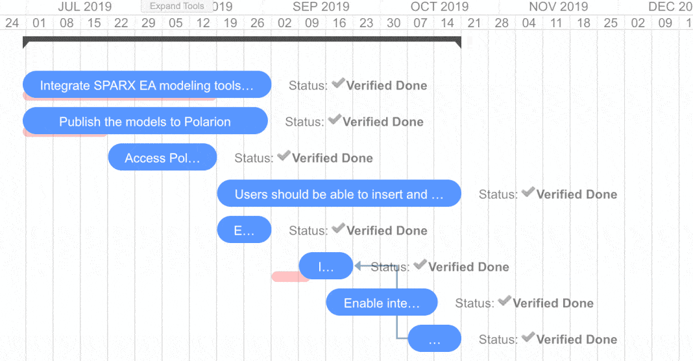

# Release Notes

## Changelog

### 1.6.1 <small>- August 27, 2019 </small>

* Support for velocity scripting in *Advanced > Gantt Script* parameter, see use case here: [How to set the Gantt time range?](https://nextedy.freshdesk.com/support/solutions/articles/48000063422-how-to-set-the-gantt-time-range-)

### 1.6.0 <small>- August 23, 2019 </small>

* Support for Markers Script, see [How to add Markers via Marker Script?](https://nextedy.freshdesk.com/solution/articles/48000862790-how-to-add-markers-via-marker-script)
* Regular bug-fixing
* Update of documementation (split of widget documentation pages for Work Items and Plans Gantt)

### 1.5.0 <small>- July 1, 2019</small>

* Big release with many customer enhancements and with addition of *Plans Gantt Widget* (added for free) justifies the big shift on version number.
* Support for duration fields in DurationTime format (converts to days only)
* Compare actual vs planned (requires Task Script to configure how to load the original schedule)

!!! warning
    Due to major refactoring (as we were adding support for Plans data type), the widget needs to be reconfigured when you update from 1.0 to 1.5. This shall not happen in the future versions. This was agreed upfront with paying customers.
    

### 1.0.3 <small>- May 29, 2019</small>
* Action menu added
* Refresh action to reload the Gantt
* Drag children control - add an option to turn on/off drag children instantly on Gantt, the widget property  holds the default
* Today Marker - add marker for today + scroll to today
* Set Scale - add an option to set the timeline scale instantly on Gantt, the widget property would hold the default.

### 1.0.2 <small>- May 28, 2019 17:20</small>
* Documentation improvements
* Script support added to decorate a task based on work item properties, see Widget > Task Script
* Infinite loop on parent links (should not happen in Polarion) does not cause gantt to fail (but data do not load).
* Project style support (via Task Script)
* License at polarion/polarion/gantt-lic.json

### 1.0.1 <small>- May 15, 2019</small>

* Published on extensions.polarion.com
* New Work Items Gantt widget icon.
* Widget tags configured -  "Work Items", "Charts" 
* `gantt.config.round-dnd-dates`  reflected when dragging children
    
### 1.0.0 <small>- May 5, 2019</small>
*  After couple of months of development and use in several customer projects we officially release the public version 1.0.0.

## TODO
	
* **Markers** - support for release/milestone markers (timepoints, plans, ...)
* **Readonly** - add widget property to mark Gantt read-only
* **Server Side Scripted Tooltip** - add widget property - a script - to hold a generation of tooltip on the server side ...
	* Partially possibly in 1.0.2 with `Task Script`
* **Item Colors based on Type** - make it possible to color the tasks based on item type.
	* Partially possibly in 1.0.2 with `Task Script`

## Known Issues
* When you collapse a left side Polarion navigator, the empty place appears on the right (collapse/drag fixes it)
