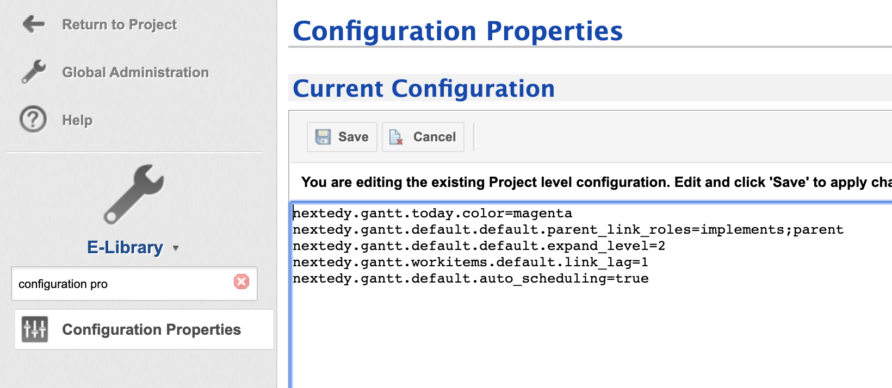

# Default Configuration Properties
You can define following propererties in **Administration > Configuration Properties**

## General Properties

* `nextedy.gantt.workitems.unplanned_color` - Color of the unplanned item. The default is: #7D3C98
* `nextedy.gantt.today.color` - Color of *today* marker. The default is: gray
* `nextedy.gantt.classic_project"` - Use the classic look of the project item type. The default is: false
* `nextedy.gantt.zoom.DD.min_column_width` - The width of the timeline column in "DD" scale mode. The default is: 120
* `nextedy.gantt.zoom.D.min_column_width` - The width of the timeline column in "D" scale mode. The default is: 60
* `nextedy.gantt.zoom.W.min_column_width` - The width of the timeline column in "W" scale mode. The default is: 30
* `nextedy.gantt.zoom.M.min_column_width` - The width of the timeline column in "M" scale mode. The default is: 70
* `nextedy.gantt.zoom.Q.min_column_width` - The width of the timeline column in "Q" scale mode. The default is: 90
* `nextedy.gantt.zoom.Y.min_column_width` - The width of the timeline column in "Y" scale mode. The default is: 40
* `nextedy.gantt.zoom.YY.min_column_width` - The width of the timeline column in "YY" scale mode. The default is: 190
* `nextedy.gantt.debug` - Enable client side debug messages. The default is: false
* `nextedy.gantt.default.auto_scheduling` - Toggle auto-scheduling by default. The default is: false
* `nextedy.gantt.default.critical_path` - Toggle visualization of critical path by default. The default is: false
		
## Work Items Gantt Widget Properties Defaults
 Following settings are used as a default values when you add a Widget to a page. **Once the widget is added to the page, the widget property values are used.**

* `nextedy.gantt.workitems.default.sort_by` -  Default value for "Sort By" property. Default is: id
* `nextedy.gantt.workitems.default.expand_level` - Default value for "Load children" property, it specifies how many levels should be added to the dataset. Default is: 0
* `nextedy.gantt.workitems.default.show_unplanned` -  Default value for "Show Unplanned" property. Default is: true
* `nextedy.gantt.workitems.default.scale` -  Default value for "Scale" property. Default is: W
* `nextedy.gantt.workitems.default.parent_link_roles` -  Default value for "Parent Link Roles" property. It is a list of link role IDs separated by ";".  Default is: *empty*
* `nextedy.gantt.workitems.default.dependency_link_roles` -  Default value for "Dependency Link Roles" property. It is a list of link role IDs separated by ";".  Default is: *empty*
* `nextedy.gantt.workitems.default.start_field"` -  Default value for "Start Field" property. Default is: gantt_start
* `nextedy.gantt.workitems.default.end_field` -  Default value for "End Field" property. Default is: *none*
* `nextedy.gantt.workitems.default.duration_field` -  Default value for "Duration Field" property. Default is: gantt_duration
* `nextedy.gantt.workitems.default.progress_field` -  Default value for "Progress Field" property. Default is: gantt_progress             
* `nextedy.gantt.workitems.default.maximize_view` -  Default value for "Maximize" property. Default is: false
* `nextedy.gantt.workitems.default.hide_toolbar` -  Default value for "Hide Toolbar" property. Default is: false
* `nextedy.gantt.workitems.default.progress_coloring` -  Default value for "Progress Coloring" property. Default is: true
* `nextedy.gantt.workitems.default.drag_children` -  Default value for "Drag Children" property. Default is: true
* `nextedy.gantt.workitems.default.max_items` -  Default value for "Max Items" property. Default is: 100
* `nextedy.gantt.workitems.default.show_today_marker` -  Default value for "Show Today Marker" property. Default is: true
* `nextedy.gantt.workitems.default.working_time` -  Default value for "Show Today Marker" property. Default is: true
 
Additional defaults, not yet possible to be configured on specific instance of Gantt Widget

* `nextedy.gantt.workitems.default.forward_dependency` - By default in Polarion there is a link role DEPENDS_ON, linking task A with task B, so A depends on B (A can be started after B), if you link the tasks other way around (from B to A), set this to true.  The default value is: false
* `nextedy.gantt.workitems.default_duration` - the default duration of an item, if not specified in task itself, in days. The default is: 10
* `nextedy.gantt.workitems.default.link_lag` - the default lead/lag time for dependency links. Default it: 0
 
## Plans Gantt Widget Properties Defaults
 These value are used as a default values when you add a Widget to a page. Once it is added, the widget values are used.
 
* `nextedy.gantt.plans.default.sort_by` -  Default value for "Sort By" property. Default is: id
* `nextedy.gantt.plans.default.expand_level` - Default value for "Load children" property, it specifies how many levels should be added to the dataset. Default is: 0
* `nextedy.gantt.plans.default.show_unplanned` -  Default value for "Show Unplanned" property. Default is: true
* `nextedy.gantt.default.plans.scale` -  Default value for "Scale" property. Default is: W
* `nextedy.gantt.plans.default.maximize_view` -  Default value for "Maximize" property. Default is: false
* `nextedy.gantt.plans.default.hide_toolbar` -  Default value for "Hide Toolbar" property. Default is: false
* `nextedy.gantt.plans.default.progress_coloring` -  Default value for "Progress Coloring" property. Default is: true
* `nextedy.gantt.plans.default.drag_children` -  Default value for "Drag Children" property. Default is: true
* `nextedy.gantt.plans.default.max_items` -  Default value for "Max Items" property. Default is: 100
* `nextedy.gantt.plans.default.show_today_marker` -  Default value for "Show Today Marker" property. Default is: true
* `nextedy.gantt.plans.default.working_time` -  Default value for "Show Today Marker" property. Default is: true
   

    