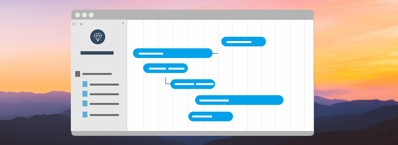
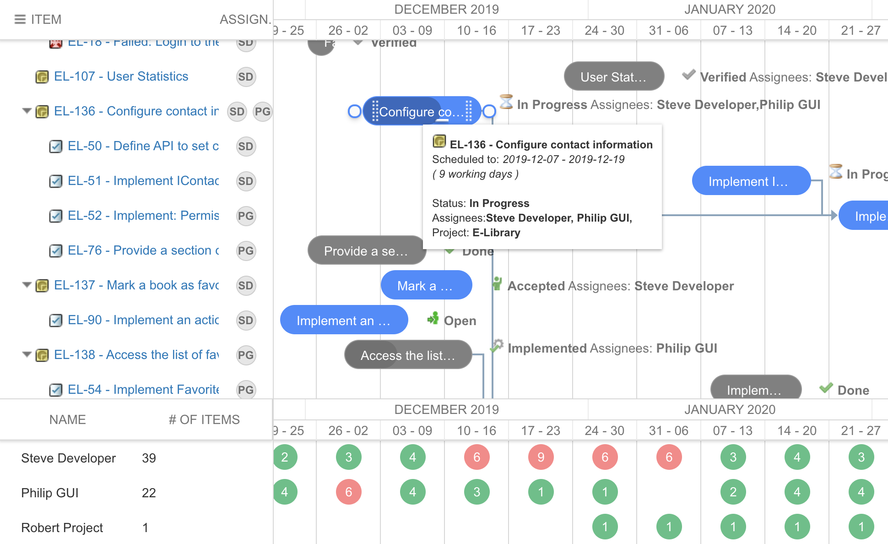

# Nextedy GANTT

The first **interactive** high-level project planning & scheduling in **Polarion ALM**. 

* *Gain better user satisfaction with fine-tuned planning views*
* *Hold your plans faithful as they become trivial to maintain*
* *Bring more transparency into cross-project dependencies and progress*

 
<a href="./download">
<button class="mdc-button">&nbsp;Try Now!&nbsp;</button>
</a>

 

The drag & drop enabled Gantt chart widgets provides unique capabilities to manage the standard Work Items (such as Features, Epics, Objectives, ...) as micro projects in a visually appealing way and perform various operations easily and efficiently.

 
<iframe width="100%" height="350" src="https://www.youtube.com/embed/9D_djgsCIac" frameborder="0" allow="accelerometer; autoplay; encrypted-media; gyroscope; picture-in-picture" allowfullscreen></iframe>

## Schedule with Ease

Easily adjust the project schedule.

Re-schedule the subtasks automatically when the parent project schedule is adjusted - or the other way around.

<i>Did you know?</i>
<h3>Nextedy was founded by two former Polarion VPs</h3>
To deliver applications that  span across oceans we rely on our experience and expertise in running worldwide software product projects,  as well as on highly motivated teams.
 
<a href="https://www.nextedy.com/who/" style="float:right"><button class="mdc-button" style="background-color:#2096f3">Who we are?&nbsp;</button></a>
 

## Instant Dependencies

Spot the project dependencies instantly.

 Set the dependency as quick as in a single second.

## Versioning

Highlight the differences of the current state against the original plan.

## Resource Allocation View
The resource management view is quite critical for many projects because it helps to estimate not only a total load of a project, but its parts and load of each resource separately.

## Other Polarion Solutions by Nextedy Systems

  <a href="https://worksheet.nextedy.com/">
  
  
  
    <h4><b>Nextedy WORKSHEET</b></h4>
    
Interactive Work Tracking and Team Assignments for Polarion ALM.

  

  </a>

  <a href="https://checklist.nextedy.com/">
  
  

    <h4><b>Nextedy CHECKLIST</b></h4>
    
Extend your Polarion with action-able checklists to support your workflow process.

  

  </a>

   
