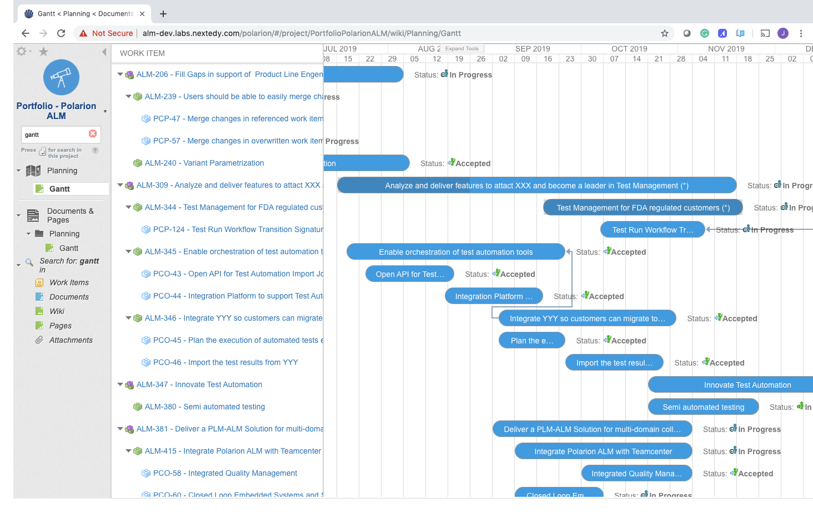
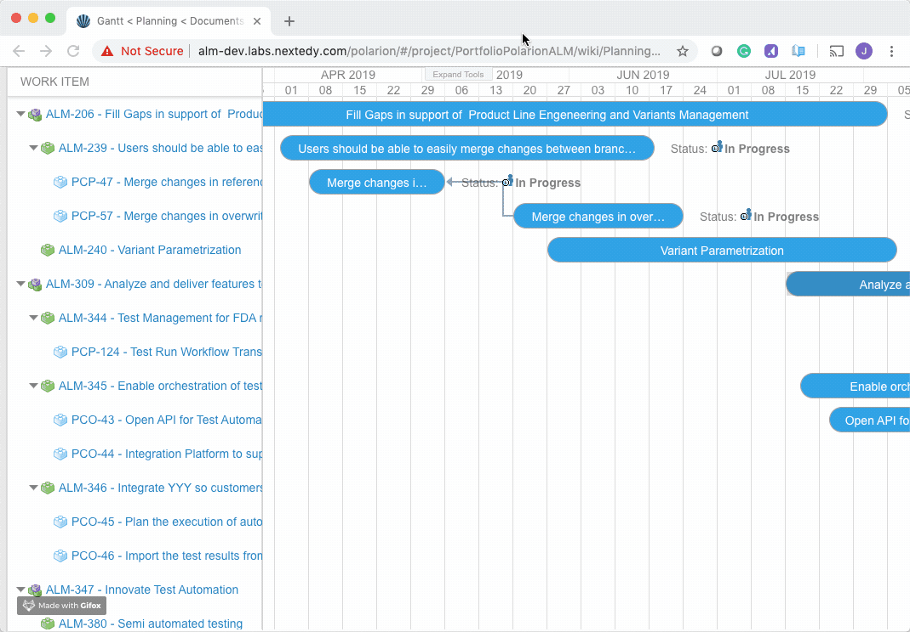
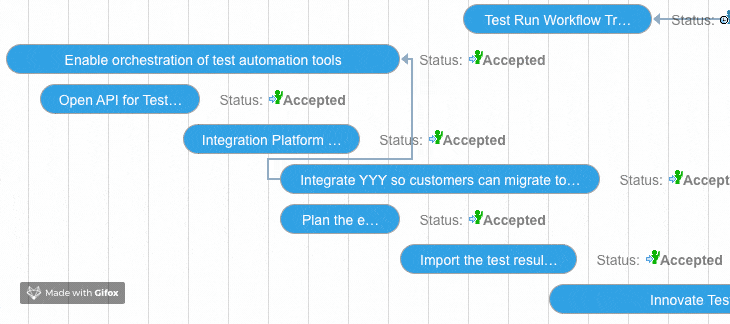
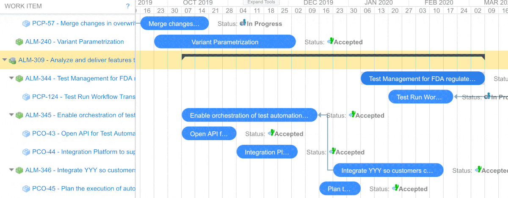

# Work Items Gantt 

*Work Items Gantt* brings the interactive high-level project planning & scheduling to Polarion ALM. 

<a href="https://gantt.nextedy.com/download/work_items_gantt.zip">
<button class="mdc-button">Download Now!</button>
</a>

 

Interactive drag & drop enabled Gantt chart widget provides unique capabilities to expose the standard Work Items (such as Features, Epics, Objectives, ...) as micro projects in a visually appealing way and perform various operations easily and efficiently.

<a href="https://youtu.be/9D_djgsCIac">

**Play Overview Video**

</a>

## Adjust Schedule

You can easily adjust the project schedule, including re-scheduling of the subtasks when the parent project schedule is adjusted:

## Manage Dependencies

The Management of project and task dependencies is another common task. Just start a link on start item and finish it on target item:

## Project Types

Sometimes the task schedule should be derivered from the children, this is exactly what is covered by `project` type. (Task Script needs to be used to configure what work items are of type `project`

