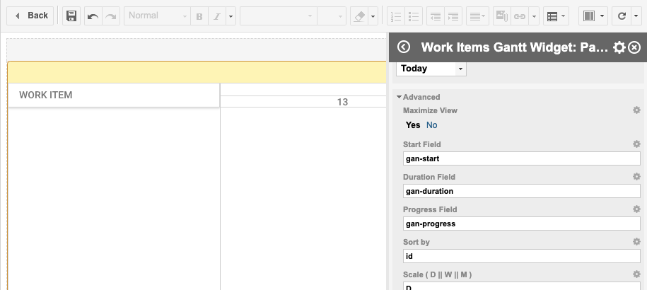

# Setup

You have two options:

1.	Setup Gantt as full report view
2.	Add interactive Gantt widget to your existing report

##  Full report gantt

A common approach to integrating Work Items Gantt to Polarion ALM is to create a single Report page, e.g. Gantt, and put the Work Items Gantt Widget as single widget there.

To use gannt in full report view, activate following property:

* `Advanced` >  `Maximize` - set the Maximize property of the widget to 'yes'

Please make sure there are no additional empty paragraphs or other whitespace content around the widget.

##  Gantt as widget

It of course makes sense to sometimes embedd the gantt view on existing reports, together with other reporting widgets, to do so:

* `Advanced` >  `Maximize` - set the Maximize property of the widget to 'no'

## Limitation

Currently it is possible to have only one Gantt widget on a page.

