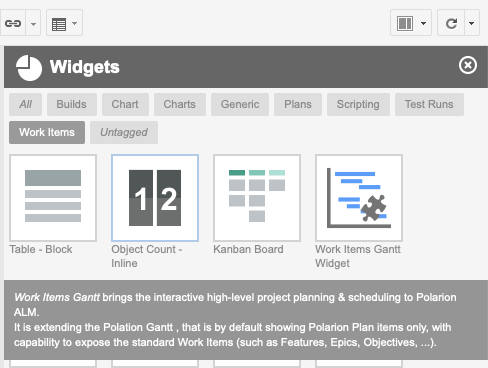

# Work Items Gantt Widget

The *Work Item Gantt* widget is listed under  *Work Items* tag:

!!! info
    Currently, it is possible to have only one Work Item Gantt widget on a page.

## Widget Parameters 
 
* **`Work Items`** - a standard data set parameter. Select what work items you want to see on your Gantt chart.

* **`Sort by`** -  the sort criteria to sort the top level work items.

* **`Load Children`** - define how many levels of child items should be traversed and added to the list in addition to the items from `Work Items` date set parameter. 
    
    Zero (0) means that no additional items are shown.
    
* **`Show Unplanned`** - click on `no` to hide all the work items that do not have the `Start Field` set. 

    If you keep it set to `yes`, such tasks will be in the list, scheduled for 'Today', and marked by *gray* color. 

* **`Scale ( D || W || M )`** -  configures the scale of the Gantt timeline. Values are: 
    + 'D' - day
    + 'W' - week
    + 'M' - Month

* **`Parent Role`** - select what Work Item link roles should be used to detect the parent-child relationships. If empty, no hierarchy is shown.

* **`Dependency Role`** - select what Work Item link roles should be used to detect Depends-on relationships. If empty, no dependencies will be shown. 

    If you select multiple link roles, the first role is used when creating new links.

## Data Mapping

**You should select a combination of :  *Start Field & Duration Field* , *End Field & Duration Field*, or *Start Field & End Field"* **

* **`Start Field`** -  sets the name of the custom field that stores the information when the work item starts. 

	The type of the custom field can be any of these: Date, Date-Time or String. 
	
	If such custom field does not exist, the value will be stored in String ad-hoc custom field. For production use, we recommend using a Date (Only) custom field.

* **`End Field`** -  sets the name of the custom field that stores the information when the work item ends. 

	The type of the custom field can be any of these: Date, Date-Time or String. 
	
	If such custom field does not exist, the value will be stored in String ad-hoc custom field. For production use, we recommend using a Date (Only) custom field.

* **`Duration Field`** -  sets the name of the custom field, that stores the information about the work item duration as the number of days. 

	The type of the custom field can be any of these: Integer or String.  
	
	If such custom field does not exist, the value will be stored in String ad-hoc custom field. For production use, we recommend using an Integer custom field.

* **`Progress Field`** - the name of the custom field, that stores the progress of the work item progress as Float (multiply by 100 to get % of completion). 

	The type of the custom field can be any of these: Float or String.  
	
	If such custom field does not exist, the value will be stored in String ad-hoc custom field. For production use, we recommend using a Float custom field.

## Advanced Parameters

* **`Maximize View`** -  configure if the widget should expand its content over the full working area. See [Setup](../setup/).

* **`Drag Children`** -  configure if you want the child items to be rescheduled when dragging their parent's item.

* **`Max Items`** -  (Integer) limits the maximum number of work items loaded into the Gantt view.

* **`Gantt Config Script`** - a optional javascript snippet executed on the client, usually used to add additional Gantt configuration options.

	Example: [How to set the Gantt time range?](https://nextedy.freshdesk.com/support/solutions/articles/48000063422-how-to-set-the-gantt-time-range-).

* **`Item Script`** - a server side javascript snippet executed on the server to decorate the task based on the work item properties. 

	Example: [How to change text on right?](https://nextedy.freshdesk.com/support/solutions/articles/48000064501-how-to-change-text-on-right-)

* **`Markers Script`** - a server side javascript snippet executed on the server to prepare the collection of markers. Every customer is tracking the milestone differently (as timeponts, plans, workitems ...), so we keep it as much flexible as possible and we provide scripting option.. 

	Example: [How to add Markers via Marker Script?](https://nextedy.freshdesk.com/solution/articles/48000862790-how-to-add-markers-via-marker-script)

